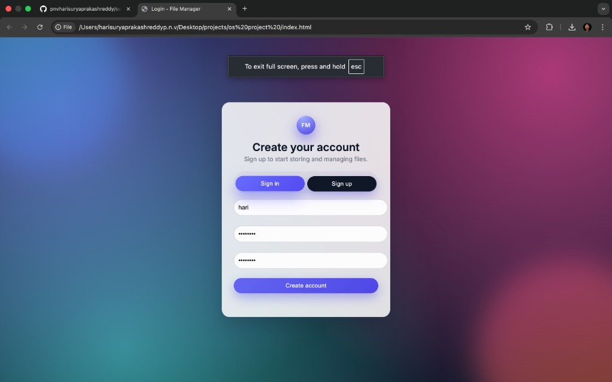
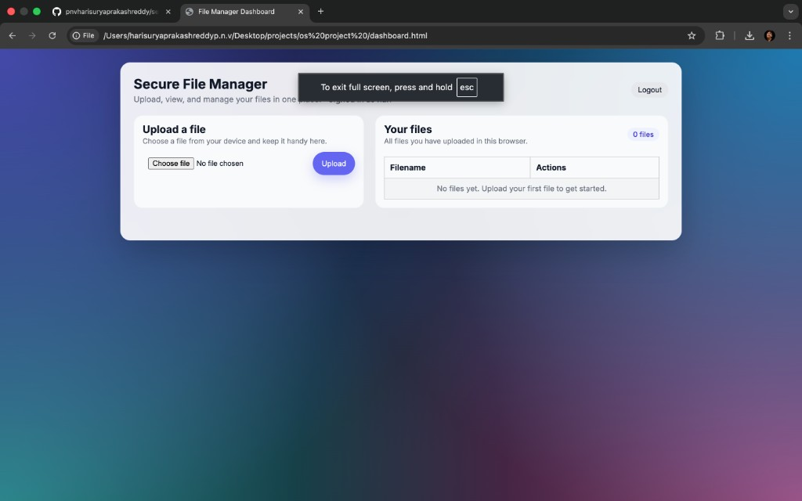
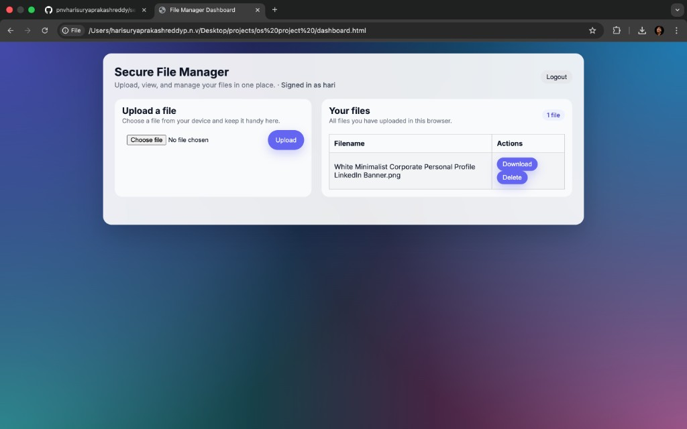

## Secure File Management System

A modern, front‑end secure file manager with sign‑up / sign‑in, per‑user file lists, and a polished dashboard UI.  
All data is stored in the browser using `localStorage` (no backend server required).

---

### Features

- **Authentication**
  - Sign **up** with username + password (min 6 chars, confirmation required).
  - Sign **in** with existing credentials.
  - Error handling for invalid login, duplicate usernames, weak passwords, and mismatched confirm password.
  - Demo users baked in: `user1/password123`, `user2/password456`.

- **Per‑user file storage**
  - Each user sees **only their own files**.
  - Files are stored in `localStorage` under a user‑specific key.
  - Uploaded file content is stored as **data URLs**, so downloads work without a backend.

- **File operations**
  - **Upload** files via file input control.
  - **Download** stored files (reconstructed from data URL).
  - **Delete** files from the current user’s list.
  - Live **file count badge** and **empty‑state message** when there are no files.

- **UI / UX**
  - Modern glassmorphism‑style **login screen** with animated gradient background and brand badge.
  - **Sign in / Sign up toggle** with dynamic heading, subtitle, and button label.
  - Responsive **dashboard layout** with separate upload and file list cards.
  - Inline **notifications** for success and error (no blocking `alert()`s).
  - Displays “**Signed in as <username>**” in the dashboard header.

---

### Technology Stack

- **HTML5** for structure (`index.html`, `dashboard.html`)
- **CSS3** for styling and animations (`styles.css`)
- **Vanilla JavaScript** for logic and state management (`scripts.js`)
- **localStorage** for:
  - User accounts (`users`)
  - Current user session (`loggedInUser`)
  - Per‑user files (`uploadedFiles_<username>`)

---

### Project Structure

- `index.html` – Auth screen with sign in / sign up toggle.
- `dashboard.html` – Main file manager dashboard.
- `styles.css` – Global styles, layouts, and animated backgrounds.
- `scripts.js` – Authentication, per‑user file handling, notifications.

---

### Screenshots

#### Auth (Sign up / Sign in)



#### Dashboard (empty state)



#### Dashboard (with a file + download)



### How to Run Locally

1. **Clone the repository**

   ```bash
   git clone https://github.com/pnvharisuryaprakashreddy/secure-file-management-system.git
   cd secure-file-management-system
   ```

2. **Start a simple HTTP server**

   Using Python:

   ```bash
   python3 -m http.server 8000
   ```

3. **Open in browser**

   Go to:

   `http://localhost:8000/index.html`

---

### Usage

1. **Sign up**
   - Click **Sign up** tab.
   - Enter a new username, password (≥ 6 characters), and confirm password.
   - On success you’ll be redirected to the dashboard and logged in.

2. **Sign in**
   - Click **Sign in** tab.
   - Use either:
     - Your own registered account, or
     - Demo: `user1/password123` or `user2/password456`.

3. **Manage files**
   - On the dashboard:
     - Use **Upload a file** card to choose a file and click **Upload**.
     - Your file appears in the **Your files** table with **Download** and **Delete** buttons.
     - The file count badge updates automatically.
   - Click **Logout** to end the session.

> Note: Files are stored in the browser only (per user, per browser). Clearing browser storage will remove them.

---

### Implementation Details

- **Authentication**
  - Default users are initialized once into `localStorage` (`DEFAULT_USERS`).
  - All users are kept in the `users` object in `localStorage`, keyed by username.
  - The current logged‑in user is tracked via `loggedInUser`.

- **Per‑user file storage**
  - Files for each user are stored under the key:  
    `uploadedFiles_<username>`
  - On dashboard load:
    - If `loggedInUser` is missing → redirect to `index.html`.
    - Otherwise:
      - Load that user’s files and render the table.
      - Show “Signed in as <username>”.

- **Downloads**
  - Uploaded files are read as data URLs with `FileReader.readAsDataURL`.
  - For download, a temporary `<a>` element is created with `href = dataUrl` and `download = filename`, then programmatically clicked.

- **Notifications**
  - The `showNotification(message, type)` helper updates a dedicated banner:
    - `type = "success"` or `"error"`.
    - Success notifications auto‑hide after a short delay.

---

### Limitations & Future Improvements

- **Security**
  - All logic is on the **client side**.
  - Passwords are stored in `localStorage` in **plain text** (not secure for production).
  - No real encryption or backend validation.

- **Potential Improvements**
  - Add a backend (Node/Express, Django, etc.) with real authentication and hashed passwords.
  - Store files in a secure backend or object storage instead of localStorage.
  - Add password reset flow and stronger password policies.
  - Add search, sorting, and filtering for files.
  - Add drag‑and‑drop upload and progress indicators.

---

### Author

- **HARI SURYA PRAKASH REDDY P.N.V**
- GitHub: `@pnvharisuryaprakashreddy`
